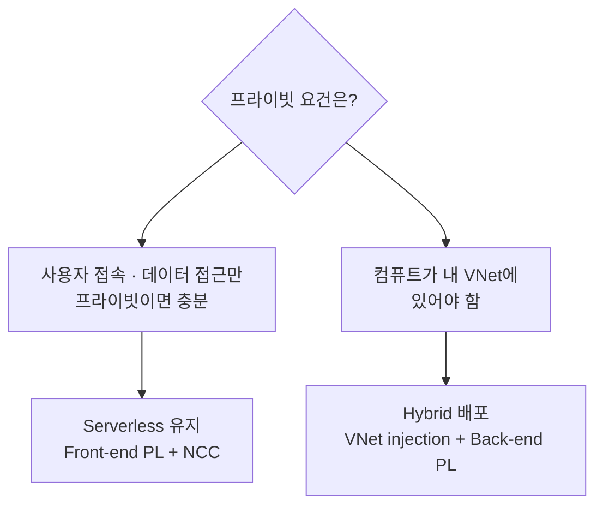

# 부록 C. 프라이빗 네트워크 배포

퍼블릭 인터넷 노출 없이 Azure Databricks를 운영해야 하는 경우의 구성 방법입니다. "프라이빗 네트워크"라는 요건은 실제로는 **두 방향**으로 나뉘며, 어느 쪽이냐에 따라 필요한 컴퓨트 모드가 달라집니다.

## C.1 먼저 결정할 것 — 서버리스로 되는가, Hybrid가 필요한가

| 요건 | 서버리스로 가능? | 필요한 구성 |
| --- | --- | --- |
| 사용자 → 워크스페이스 UI/API 프라이빗 접속 | 가능 | Front-end(인바운드) Private Link |
| 서버리스 컴퓨트 → 내 Azure 리소스 프라이빗 접근 | 가능 | NCC + private endpoint |
| 내 VNet 안에 컴퓨트 배포 (VNet injection) | 불가 | **Hybrid 필요** |
| 클러스터 → 컨트롤 플레인 프라이빗 (Back-end) | 불가 | **Hybrid 필요** |
| UDR / NVA 트래픽 검사, 커스텀 NSG·DNS | 불가 | **Hybrid 필요** |
| 온프레미스 연동 (ExpressRoute/VPN 경유 컴퓨트) | 불가 | **Hybrid 필요** |

> **⚠️ 배포 전에 결정하세요** — [1장](../guides/01-workspace-deployment/README.md)의 비교표대로 서버리스 컴퓨트 모드는 **커스텀 VNet을 지원하지 않습니다.** VNet injection이 요건이면 서버리스로는 시작할 수 없고 처음부터 Hybrid로 배포해야 하며, 컴퓨트 모드는 생성 후 전환할 수 없습니다.

> 추론 테이블용 **Access Connector는 컴퓨트 모드와 무관**하게 생성할 수 있으므로, 이 판단에 영향을 주지 않습니다([부록 A](inference-tables.md)).

## C.2 서버리스 경로

본문의 서버리스 워크스페이스를 그대로 유지하면서 적용할 수 있는 구성입니다.

### 인바운드 — Front-end Private Link

사용자와 REST API 클라이언트가 퍼블릭 IP 대신 **transit VNet의 private endpoint**를 통해 워크스페이스에 접속합니다.

- 보호 대상: 웹 애플리케이션, REST API, Databricks Apps, Databricks Connect
- 필요한 private endpoint: `databricks_ui_api`(front-end), `browser_authentication`, 계정 수준 접근용 `general_access`
- 전제: Premium 플랜

> **⚠️ browser_authentication 주의** — 브라우저 SSO 로그인에는 `browser_authentication` 엔드포인트가 필요하며, **리전·프라이빗 DNS 존당 하나만** 존재할 수 있습니다. 이 엔드포인트를 호스팅하는 워크스페이스를 삭제하면 **같은 리전의 다른 모든 워크스페이스 웹 로그인이 실패**합니다. 프로덕션에서는 이 용도의 전용 워크스페이스를 두는 것을 권장합니다.

### 아웃바운드 — NCC + private endpoint

서버리스 컴퓨트가 내 스토리지·DB에 퍼블릭 인터넷을 거치지 않고 접근하도록 합니다. NCC(Network Connectivity Configuration)는 계정 수준·리전 단위 구성으로, 여러 워크스페이스에 연결해 재사용합니다.

1. 계정 콘솔에서 **NCC** 생성 (계정 관리자 권한 필요)
2. NCC에 **private endpoint rule** 추가 — 대상 Azure 리소스 지정
3. 대상 리소스 소유자가 private endpoint 요청 **승인**
4. NCC를 워크스페이스에 **연결**

지원 범위: SQL 웨어하우스, 잡, 노트북, Lakeflow 파이프라인, **모델 서빙 엔드포인트**.

| 제한 항목 | 값 |
| --- | --- |
| 리전·계정당 NCC | 최대 10개 |
| 리전당 private endpoint | 100개 (NCC들에 분산) |
| NCC당 연결 가능 워크스페이스 | 최대 50개 |

> 모델 서빙은 모델 아티팩트를 Azure Blob 경로에서 내려받으므로 서브리소스 ID **`blob`**에 대한 private endpoint가 필요합니다. 서버리스 노트북에서 Unity Catalog에 모델을 기록하려면 **`dfs`**도 함께 필요합니다.

## C.3 Hybrid 경로 — VNet injection

컴퓨트를 내 VNet 안에 배포해야 할 때 사용합니다.

### VNet 요건

- **리전·구독**: VNet이 워크스페이스와 동일해야 함
- **주소 공간**: VNet은 `/16` ~ `/24`
- **서브넷 2개** (워크스페이스 전용): container subnet(private), host subnet(public)
  - 각 `/26` 이상 권장. 워크스페이스 간 서브넷 공유 불가, 다른 리소스 배치 불가
  - **서브넷 CIDR은 배포 후 변경 불가**
- **권한**: 워크스페이스 생성자에게 VNet에 대한 Network Contributor 역할

노드 1개당 IP 2개(host + container)를 소비하므로 클러스터 규모를 고려해 주소 공간을 잡습니다.

### 배포 절차

1. Azure Portal에서 **Azure Databricks** 리소스 생성
2. **Networking** 탭에서 VNet 선택 (목록에 없으면 리전 불일치를 먼저 확인)
3. container / host 서브넷 이름과 CIDR 지정
4. 생성 — NSG 규칙과 `Microsoft.Databricks/workspaces` 서브넷 위임은 자동 구성됨

### 검증

- 워크스페이스가 정상(failed 아님) 상태
- 두 서브넷 모두 **NSG 연결** + `Microsoft.Databricks/workspaces` **위임** 확인
- 클러스터 생성 후 Spark UI → Executors에서 드라이버·익스큐터 IP가 **private 서브넷 대역**인지 확인

### Back-end Private Link

클러스터 → 컨트롤 플레인 통신을 프라이빗으로 전환합니다.

- 전제: Premium 플랜, **VNet injection**, **SCC(Secure Cluster Connectivity)**
- 필요한 private endpoint: back-end `databricks_ui_api`
- NSG 규칙: `NoAzureDatabricksRules`

인바운드·아웃바운드와 독립적으로 구성할 수 있습니다.

## C.4 완전 격리 구성

가장 강한 격리가 필요할 때의 조합입니다.

| 항목 | 설정 |
| --- | --- |
| 전제 | Premium 플랜, VNet injection, SCC |
| 워크스페이스 네트워크 접근 | **Public access disabled** |
| NSG 규칙 | `NoAzureDatabricksRules` |
| private endpoint | front-end, back-end, browser auth, NCC **전부** |
| 비용 | 엔드포인트 수 + 데이터 전송·처리량에 비례해 가장 높음 |

## C.5 이그레스와 NAT 게이트웨이

> **⚠️ 2026년 3월 31일 이후** — 새로 만든 Azure VNet은 기본적으로 아웃바운드 인터넷 접근이 없는 상태로 생성됩니다. 새 Databricks 워크스페이스는 **NAT Gateway 같은 명시적 아웃바운드 연결 수단이 필요**합니다. 기존 워크스페이스는 영향받지 않습니다.

VNet injection 워크스페이스에서는 두 서브넷 모두에 **NAT Gateway**를 붙여 안정적인 이그레스 IP를 확보하는 것을 권장합니다. 고정 IP는 외부 서비스의 허용 목록과 IP access list에 필요합니다.

## C.6 모니터링에 미치는 영향

프라이빗 네트워킹을 적용해도 [4장](../guides/04-usage-monitoring/README.md)·[5장](../guides/05-cost-attribution/README.md)의 시스템 테이블 기반 모니터링은 그대로 동작합니다. 시스템 테이블은 Unity Catalog 안에 있으므로 네트워크 구성과 무관합니다. 다만 다음을 확인하세요.

- 모델 서빙을 프라이빗으로 쓰려면 `blob`(+ 필요 시 `dfs`) private endpoint가 있어야 엔드포인트가 정상 기동합니다
- 대상 리소스를 private endpoint만 허용하도록 잠갔다면, **클래식 컴퓨트에서의 접근도 private endpoint를 사용해야** 합니다

> **확인 포인트**
> - 프라이빗 요건이 "사용자 접속·데이터 접근"인지 "컴퓨트 위치"인지 구분했는가?
> - 후자라면 **배포 전에** Hybrid를 선택했는가? (생성 후 전환 불가)
> - 프로덕션이라면 `browser_authentication` 호스팅 워크스페이스를 별도로 지정했는가?
