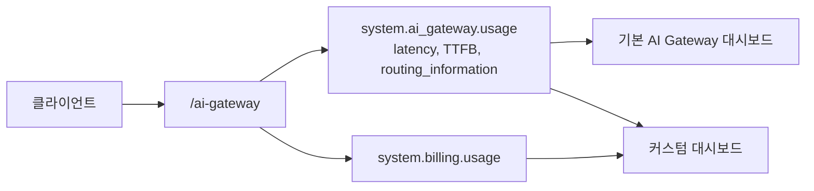
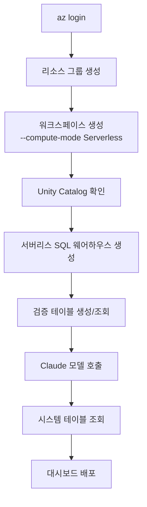

# Azure Databricks Claude 모델 운영 가이드

> **대상 독자** · Azure Databricks를 처음 배포하고 Claude 모델 사용량을 관리해야 하는 플랫폼 엔지니어, 데이터 플랫폼 운영자
>
> **선행 지식** · Azure CLI 기본, SQL 기본. Databricks 경험은 없다고 가정합니다.
>
> **범위** · 서버리스 워크스페이스 배포 → AI Gateway로 Claude 모델 호출 → 사용량·비용 모니터링 → 대시보드 구성
>
> **⚠️ 초안(Draft)** — 일반적인 운영 절차를 기준으로 작성된 리뷰용 문서입니다. 본문의 수치와 명령은 환경에 따라 달라질 수 있으며, 식별자는 모두 placeholder로 마스킹되어 있습니다.

---

## 이 가이드가 다루는 것

이 가이드는 Azure Databricks 워크스페이스를 **서버리스 컴퓨트 모드**로 배포하고, 그 위에서 **AI Gateway를 통해 Claude 모델을 호출**한 뒤, 사용량과 비용을 **시스템 테이블**로 모니터링하기까지의 전 과정을 다룹니다.

## 최종 결과물 미리보기

이 가이드를 끝까지 따르면 다음을 갖추게 됩니다.

- **서버리스 워크스페이스** — 관리형 리소스 그룹이 생성되지 않고, `managedResourceGroupId`가 `null`인 상태
- **시스템 테이블 기반 모니터링** — `system.ai_gateway.usage`, `system.billing.usage`
- **AI/BI 대시보드** — 기본 제공 AI Gateway 대시보드 + 코드로 배포하는 커스텀 대시보드

## 전체 아키텍처

모든 호출은 **AI Gateway 단일 경로**를 통과합니다. 요청 단위 사용량은 `system.ai_gateway.usage`에 기록되고, 청구는 `system.billing.usage`에 집계됩니다.

## 배포 흐름 한눈에 보기

