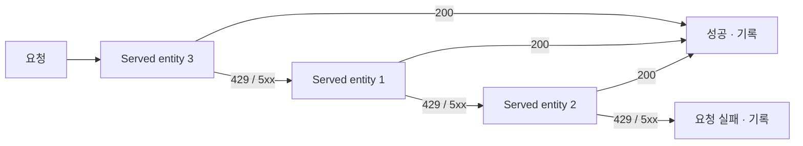

# 3. Claude 모델 호출

이 장은 이 가이드의 핵심입니다. 같은 Claude 모델이라도 **어느 라우트로 호출하느냐에 따라 경로, 모델 이름 형식, 그리고 사용량이 기록되는 시스템 테이블이 전부 달라집니다.** 이 개념을 먼저 이해하지 못하면 뒤의 모니터링 장에서 "테이블이 비어 있다"는 문제로 반드시 막힙니다.

## 3.1 사용 가능한 엔드포인트 확인

워크스페이스에서 호출 가능한 Claude 엔드포인트를 먼저 확인합니다.

```bash
databricks serving-endpoints list \
  | grep -i claude
```

또는 REST로:

```bash
curl -s \
  https://adb-<workspace-id>.<shard>.azuredatabricks.net/api/2.0/serving-endpoints \
  -H "Authorization: Bearer $DATABRICKS_TOKEN" \
  | jq '.endpoints[].name'
```

## 3.2 라우트 개념 — 이 가이드의 핵심

Claude를 호출하는 방법은 두 가지입니다. **라우트가 기록 위치를 결정합니다.**

| 라우트 | 경로 | 모델 이름 형식 | 기록 테이블 |
| --- | --- | --- | --- |
| serving | `{host}/serving-endpoints` | `databricks-claude-*` | `system.serving.endpoint_usage` |
| gateway | `{host}/ai-gateway/anthropic/v1/messages` | `system.ai.claude-*` | `system.ai_gateway.usage` |

- **serving 라우트**는 Databricks Model Serving 엔드포인트를 직접 호출합니다. 모델 이름은 `databricks-claude-*` 형식입니다.
- **gateway 라우트**는 AI Gateway를 통해 Anthropic 메시지 API 형식으로 호출합니다. 모델 이름은 Unity Catalog 모델 서비스 형식인 `system.ai.claude-*`를 사용합니다.

두 라우트는 완전히 별개의 경로이며, **사용량이 기록되는 요청 단위 테이블도 서로 배타적**입니다. 이 점이 4장 모니터링의 출발점입니다.

## 3.3 클라이언트 코드

검증에는 다중 모델을 지원하는 클라이언트(`claude_client.py`)를 사용했습니다. 주요 기능은 다음과 같습니다.

- **다중 모델** — 여러 Claude 모델을 하나의 클라이언트로 호출
- **`--route`** — `serving` 또는 `gateway` 선택
- **`--team` / `--purpose` 태깅** — 호출에 귀속 정보를 부착 (비용 귀속에 사용, 5장 참조)
- **실패 격리** — 한 모델 호출이 실패해도 나머지 호출은 계속 진행

**serving 라우트 호출 예:**

```bash
python claude_client.py \
  --route serving \
  --model databricks-claude-sonnet-4-5 \
  --team team_alpha \
  --purpose summarization \
  --prompt-file ./inputs/sample.txt
```

**gateway 라우트 호출 예:**

```bash
python claude_client.py \
  --route gateway \
  --model system.ai.claude-haiku-4-5 \
  --team team_beta \
  --purpose classification \
  --prompt-file ./inputs/sample.txt
```

## 3.4 Fallback 구성

하나의 엔드포인트에 여러 모델(served entity)을 올려두면, 요청이 실패했을 때 다음 모델로 자동 재시도하도록 구성할 수 있습니다. AI Gateway 섹션에서 **Enable fallbacks**를 선택해 활성화합니다.

### 동작 규칙

| 항목 | 내용 | 주의 |
| --- | --- | --- |
| 트리거 조건 | `429` 또는 `5XX` 응답 | 그 외 `4XX`는 fallback되지 않고 그대로 실패 |
| 시도 순서 | 엔드포인트 생성·최종 수정 시 모델이 나열된 순서 | **트래픽 비율은 순서에 영향을 주지 않음** |
| 최대 개수 | fallback 2개 (총 3개 엔티티 시도) | 모두 실패하면 요청 실패 |
| 재시도 방식 | 각 엔티티를 순차적으로 1회씩 | 같은 엔티티를 반복 재시도하지 않음 |
| 지원 대상 | External models 전용 | BYOK로 연결한 외부 공급자 모델 |
| 전제 조건 | 다른 모델에 트래픽 비율을 먼저 할당 | 할당 전에는 활성화 불가 |

트래픽 비율을 **`0%`**로 지정한 모델은 평상시에는 호출되지 않고 **fallback 전용**으로만 동작합니다. 평소 트래픽은 주 모델로 보내되 장애 시에만 예비 모델을 쓰고 싶을 때 이 방식을 사용합니다.



> **⚠️ 모니터링 영향** — fallback이 발생하면 **첫 성공 시도 또는 마지막 실패 시도만** usage tracking·payload logging 테이블에 기록됩니다. 중간에 실패한 시도는 남지 않으므로, **클라이언트 호출 수와 시스템 테이블 행 수가 어긋날 수 있습니다**([4장](../04-usage-monitoring/README.md) 참조).
