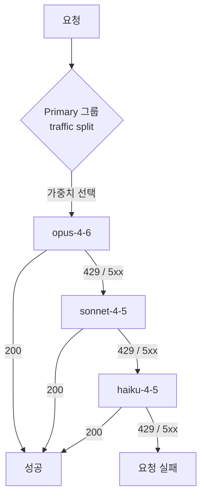

# 3. Claude 모델 호출

이 장은 이 가이드의 핵심입니다. **AI Gateway를 통해 Claude 모델을 호출**하는 방법과, 호출이 어느 시스템 테이블에 기록되는지를 다룹니다.

## 3.1 사용 가능한 모델 확인

워크스페이스에서 호출 가능한 AI Gateway 모델 서비스를 먼저 확인합니다. 사이드바 **AI Gateway** → **Models**에서 목록을 볼 수 있고, `system.ai` 스키마의 기본 제공 모델은 별도 설정 없이 바로 사용할 수 있습니다.

Unity Catalog에서 조회할 수도 있습니다.

```sql
SHOW MODELS IN system.ai;
```

## 3.2 호출 경로

AI Gateway는 다음 경로로 호출합니다.

| 항목 | 값 |
| --- | --- |
| 경로 | `{host}/ai-gateway/anthropic/v1/messages` |
| 모델 이름 형식 | `system.ai.claude-*` |
| 인증 | `Authorization: Bearer $DATABRICKS_TOKEN` |
| 기록 테이블 | `system.ai_gateway.usage` |

MLflow 호환 경로(`{host}/ai-gateway/mlflow/v1/chat/completions`)도 제공되며, 이 경우 모델 이름은 `system.ai.databricks-claude-*` 형식을 사용합니다.

```bash
curl "https://adb-<workspace-id>.<shard>.azuredatabricks.net/ai-gateway/anthropic/v1/messages" \
  -H "Authorization: Bearer $DATABRICKS_TOKEN" \
  -H "Content-Type: application/json" \
  -d '{
    "model": "system.ai.claude-sonnet-4-5",
    "max_tokens": 1024,
    "messages": [{"role": "user", "content": "What is Databricks?"}]
  }'
```

> **⚠️ 인증 방식** — Anthropic 공개 API와 달리 `x-api-key`가 아니라 **`Authorization: Bearer`** 를 사용합니다.

## 3.3 클라이언트 코드

AI Gateway는 **OpenAI·Anthropic 양쪽 SDK와 호환**되므로, 기존 코드에서 `base_url`과 인증 헤더만 바꾸면 그대로 동작합니다.

**Anthropic SDK — `messages` 경로**

```python
import os
from anthropic import Anthropic

client = Anthropic(
    api_key=os.environ["DATABRICKS_TOKEN"],
    base_url=f"{os.environ['DATABRICKS_HOST']}/ai-gateway/anthropic",
)

message = client.messages.create(
    model="system.ai.claude-sonnet-4-5",
    max_tokens=1024,
    messages=[{"role": "user", "content": "What is Databricks?"}],
)
print(message.content[0].text)
```

**OpenAI SDK — MLflow 호환 경로**

```python
import os
from openai import OpenAI

client = OpenAI(
    api_key=os.environ["DATABRICKS_TOKEN"],
    base_url=f"{os.environ['DATABRICKS_HOST']}/ai-gateway/mlflow/v1",
)

response = client.chat.completions.create(
    model="system.ai.databricks-claude-sonnet-4-5",
    max_tokens=1024,
    messages=[{"role": "user", "content": "What is Databricks?"}],
)
print(response.choices[0].message.content)
```

> 토큰은 반드시 환경 변수(`$DATABRICKS_TOKEN`)로만 다루고, 프롬프트와 응답 본문은 로그에 남기지 마세요.

## 3.4 Fallback 구성

요청이 실패했을 때 다음 모델로 자동 재시도하도록 구성하면 가용성을 높일 수 있습니다.

> **⚠️ `system.ai` 기본 model API는 fallback을 "소유"할 수 없습니다**
>
> `system.ai` 스키마의 기본 제공 model API(예: `system.ai.databricks-claude-opus-5`)는 Databricks가 소유하며 destination이 단일 모델로 고정됩니다. 해당 모델의 **Routing** 탭에 들어가도 destination 추가 UI 없이 다음 안내만 표시됩니다.
>
> > *To configure fallbacks or traffic splits, create your own Model Service.*
>
> 다만 이는 **fallback을 구성하는 주체가 될 수 없다**는 뜻이며, **다른 model service의 destination으로는 자유롭게 사용할 수 있습니다.** 실제로 커스텀 model service의 primary·fallback을 모두 `system.ai.databricks-claude-*` Pay-per-token 모델로 채울 수 있습니다.
>
> 따라서 fallback을 쓰려면 **직접 model service를 생성**해야 합니다. 사이드바 **AI Gateway** → **Create** (또는 Catalog Explorer → 대상 스키마 → `Create` > `Service` > `Model service`)

### 구성 방법

`AI Gateway` → 대상 model service → **Routing** 탭에서 구성합니다. 화면은 **Primary 그룹**과 그 아래로 이어지는 **fallback 체인** 구조입니다.

| 버튼 | 위치 | 역할 |
| --- | --- | --- |
| `+ Add another model` | Primary 그룹 **안쪽** | 같은 단계에 모델 추가 → **traffic split**(가중치 분배) |
| `Add fallback` | 화면 **맨 아래** | 새 fallback **단계** 추가 → 순차 재시도 체인 |

**트래픽 비율 설정** — Primary 그룹에 모델이 1개뿐이면 트래픽이 100% 한 곳으로 갈 수밖에 없으므로 **Traffic percentage 입력란이 표시되지 않습니다.** `+ Add another model`로 두 번째 모델을 추가하면 각 행에 입력란이 나타나며, **합계가 100%가 되면 자동 저장**됩니다(별도 Save 버튼 없음).

**동작 순서**

1. traffic split이 가중치에 따라 Primary 그룹에서 **하나의 destination을 선택**합니다.
2. 해당 destination으로 요청을 보냅니다.
3. `429`·`5xx`로 실패하면 **지정한 순서 그대로** fallback 단계를 순차 재시도합니다.
4. 성공하거나 모든 단계를 소진할 때까지 반복합니다.



- 재시도 시 traffic split은 **다시 적용되지 않습니다**. primary 선택은 요청당 1회뿐입니다.
- **traffic split은 최대 5개 destination**까지 구성할 수 있습니다. 이 상한은 트래픽을 나눠 받는 **Primary 그룹에만** 적용되며, 그 아래로 이어지는 fallback 단계 수와는 별개입니다.
- **fallback destination에는 traffic split을 설정할 수 없습니다.** 각 fallback 단계는 단일 destination으로만 구성됩니다.
- fallback 단계 수에는 공식 상한이 문서화돼 있지 않습니다(4단계 이상 구성 확인).
- Primary에 모델이 2개 이상이면 **session affinity가 자동 활성화**됩니다. 세션 식별 헤더를 보내는 클라이언트의 요청은 같은 destination에 고정되므로, **짧은 테스트에서는 설정한 비율이 그대로 관측되지 않을 수 있습니다.**

라우팅 결과는 `system.ai_gateway.usage`의 `routing_information` 필드에 기록되므로 실제 분배와 fallback 발생 여부를 검증할 수 있습니다.

```sql
SELECT
  destination_name,
  COUNT(*) AS request_count,
  ROUND(COUNT(*) * 100.0 / SUM(COUNT(*)) OVER (), 1) AS actual_pct
FROM system.ai_gateway.usage
WHERE endpoint_name = 'your-model-service-name'
  AND event_time >= CURRENT_TIMESTAMP - INTERVAL 7 DAY
GROUP BY destination_name
ORDER BY actual_pct DESC;
```

### legacy Serving endpoint 참고

기존 Model Serving 엔드포인트에도 별도의 fallback 기능이 있습니다. 이 가이드는 AI Gateway를 기준으로 하므로 자세히 다루지 않지만, 제약이 다르다는 점만 알아두면 됩니다. legacy는 **External models 전용**이고 **fallback을 최대 2개**까지만 지정할 수 있으며, 시도 순서를 직접 정할 수 없습니다. 또한 다른 모델에 트래픽 비율을 먼저 배분해야 활성화됩니다. 자세한 내용은 [Databricks 공식 문서](https://docs.databricks.com/aws/en/ai-gateway/configure-ai-gateway-endpoints)를 참조하세요.

> **⚠️ 모니터링 영향** — fallback이 발생하면 legacy 엔드포인트에서는 **첫 성공 시도 또는 마지막 실패 시도만** 사용량 테이블에 기록되어, 클라이언트 호출 수와 테이블 행 수가 어긋날 수 있습니다. AI Gateway는 `routing_information` 필드로 라우팅 결정을 남기므로 이 한계가 완화됩니다([4장](../04-usage-monitoring/README.md) 참조).

## 3.5 커스텀 model service로 얻는 것

`system.ai` 기본 model API는 설정 없이 바로 쓸 수 있지만, **구성할 수 있는 것이 없습니다.** 직접 model service를 만들면 거버넌스·운영 기능이 함께 열립니다. 특히 **로깅 범위가 크게 넓어집니다.**

| 기능 | `system.ai` 기본 API | 커스텀 model service |
| --- | --- | --- |
| 요청 단위 사용량 (`ai_gateway.usage`) | ✅ | ✅ |
| **inference tables** (요청·응답 페이로드 로깅) | ❌ | ✅ |
| **fallback** | ❌ | ✅ |
| **traffic split** | ❌ | ✅ |
| rate limits | ❌ | ✅ |
| service policies (guardrails) | ❌ | ✅ |

### inference tables — 페이로드 수준 로깅

`ai_gateway.usage`는 토큰 수·지연·상태 코드 같은 **메타데이터**만 남깁니다. 실제 프롬프트와 응답 본문까지 보려면 **inference tables**를 켜야 하며, 이는 커스텀 model service에서만 가능합니다.

기록되는 주요 컬럼은 다음과 같습니다.

| 컬럼 | 내용 |
| --- | --- |
| `request` / `response` | 원본 JSON 페이로드 |
| `request_id` / `invocation_id` | 요청 식별자 · 개별 추론 호출 식별자 |
| `destination_type` | 어떤 destination이 응답했는지 |
| `status_code`, `latency_ms`, `time_to_first_byte_ms` | 상태·지연 |
| `request_tags` | 요청에 부착한 태그 (예: `{"team": "engineering"}`) |

> `invocation_id`는 하나의 `request_id` 안에서 여러 번 발생한 추론을 구분합니다. **fallback이 일어난 요청**이나 guardrail 검사처럼 내부적으로 여러 번 호출된 경우를 추적할 때 사용합니다.

**활성화 방법** — model service를 만든 **뒤에** 설정합니다.

1. 사이드바 **AI Gateway** → model service 선택
2. **Inference tables** 옆 **Set Up** 클릭
3. 테이블을 만들 catalog·schema 지정 → **Save**

**요건과 주의사항**

- model service에 대한 `MANAGE` 권한, 대상 catalog·schema에 `USE CATALOG`·`USE SCHEMA`·`CREATE TABLE` 권한이 필요합니다.
- **기존 테이블을 지정할 수 없습니다.** 첫 요청을 받은 뒤 Databricks가 새 테이블을 자동 생성하며, 행이 나타나기까지 최대 1시간이 걸릴 수 있습니다.
- 테이블의 **스키마·이름을 바꾸거나 삭제하면 로깅이 중단되거나 손상**됩니다.
- inference tables는 **과금 대상 기능**입니다. 기록되는 요청·응답에 대해 비용이 발생합니다.

> **⚠️ 외부 스토리지 카탈로그가 필요합니다** — 추론 테이블은 **external storage 카탈로그에만** 생성할 수 있고 **default storage 카탈로그는 지원되지 않습니다.** 서버리스 워크스페이스의 기본 카탈로그는 default storage를 사용하므로, 활성화 전에 외부 스토리지 구성이 선행되어야 합니다. 절차는 [부록 A](../../appendix/inference-tables.md)를 참조하세요.
>
> 그 밖에 **10 MiB 초과 페이로드는 기록되지 않고**, `401`·`403`·`429`·`500` 응답은 누락될 수 있으며, 적재는 **best effort**로 전달이 보장되지 않습니다.
