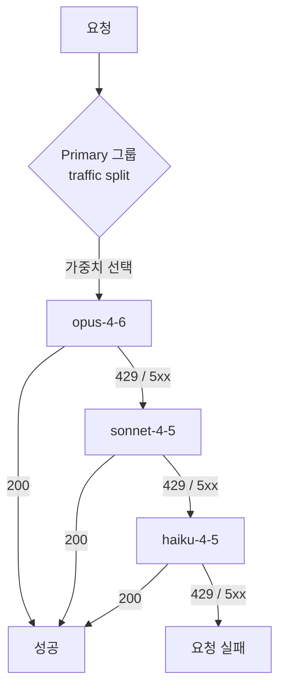
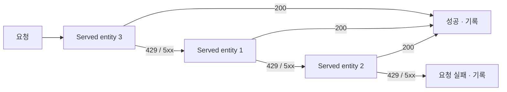

# 3. Claude 모델 호출

이 장은 이 가이드의 핵심입니다. 같은 Claude 모델이라도 **어느 라우트로 호출하느냐에 따라 경로, 모델 이름 형식, 그리고 사용량이 기록되는 시스템 테이블이 전부 달라집니다.** 이 개념을 먼저 이해하지 못하면 뒤의 모니터링 장에서 "테이블이 비어 있다"는 문제로 반드시 막힙니다.

## 3.1 사용 가능한 엔드포인트 확인

워크스페이스에서 호출 가능한 Claude 엔드포인트를 먼저 확인합니다.

```bash
databricks serving-endpoints list \
  | grep -i claude
```

또는 REST로:

```bash
curl -s \
  https://adb-<workspace-id>.<shard>.azuredatabricks.net/api/2.0/serving-endpoints \
  -H "Authorization: Bearer $DATABRICKS_TOKEN" \
  | jq '.endpoints[].name'
```

## 3.2 라우트 개념 — 이 가이드의 핵심

Claude를 호출하는 방법은 두 가지입니다. **라우트가 기록 위치를 결정합니다.**

| 라우트 | 경로 | 모델 이름 형식 | 기록 테이블 |
| --- | --- | --- | --- |
| serving | `{host}/serving-endpoints` | `databricks-claude-*` | `system.serving.endpoint_usage` |
| gateway | `{host}/ai-gateway/anthropic/v1/messages` | `system.ai.claude-*` | `system.ai_gateway.usage` |

- **serving 라우트**는 Databricks Model Serving 엔드포인트를 직접 호출합니다. 모델 이름은 `databricks-claude-*` 형식입니다.
- **gateway 라우트**는 AI Gateway를 통해 Anthropic 메시지 API 형식으로 호출합니다. 모델 이름은 Unity Catalog 모델 서비스 형식인 `system.ai.claude-*`를 사용합니다.

두 라우트는 완전히 별개의 경로이며, **사용량이 기록되는 요청 단위 테이블도 서로 배타적**입니다. 이 점이 4장 모니터링의 출발점입니다.

## 3.3 클라이언트 코드

검증에는 다중 모델을 지원하는 클라이언트(`claude_client.py`)를 사용했습니다. 주요 기능은 다음과 같습니다.

- **다중 모델** — 여러 Claude 모델을 하나의 클라이언트로 호출
- **`--route`** — `serving` 또는 `gateway` 선택
- **`--team` / `--purpose` 태깅** — 호출에 귀속 정보를 부착 (비용 귀속에 사용, 5장 참조)
- **실패 격리** — 한 모델 호출이 실패해도 나머지 호출은 계속 진행

**serving 라우트 호출 예:**

```bash
python claude_client.py \
  --route serving \
  --model databricks-claude-sonnet-4-5 \
  --team team_alpha \
  --purpose summarization \
  --prompt-file ./inputs/sample.txt
```

**gateway 라우트 호출 예:**

```bash
python claude_client.py \
  --route gateway \
  --model system.ai.claude-haiku-4-5 \
  --team team_beta \
  --purpose classification \
  --prompt-file ./inputs/sample.txt
```

## 3.4 Fallback 구성

요청이 실패했을 때 다음 모델로 자동 재시도하도록 구성하면 가용성을 높일 수 있습니다. Databricks에는 **서로 다른 두 개의 fallback 체계**가 있으며, 제약과 UI가 완전히 다릅니다.

### 어느 쪽에서 구성하는가

| 구분 | Unity AI Gateway (권장) | legacy Serving endpoint |
| --- | --- | --- |
| 구성 단위 | model service의 **destination** | 엔드포인트의 **served entity** |
| UI 경로 | `AI Gateway` → model service → **Routing** 탭 | Serving 엔드포인트 → **AI Gateway** 섹션 → `Enable fallbacks` |
| 순서 지정 | **우선순위 직접 지정** | 모델이 나열된 순서로 고정 |
| fallback 개수 | 공식 상한 미명시 (4단계 이상 구성 확인) | **2개** (총 3개 엔티티) |
| destination 종류 | Pay-per-token 모델도 사용 가능 | **External models 전용** |
| 트래픽 배분 전제 | 불필요 (fallback 단독 사용 가능) | 필수 (배분 전에는 활성화 불가) |
| 라우팅 기록 | `system.ai_gateway.usage`의 `routing_information` | `system.serving.endpoint_usage` |

> **⚠️ `system.ai` 기본 model API는 fallback을 *소유*할 수 없습니다**
>
> `system.ai` 스키마의 기본 제공 model API(예: `system.ai.databricks-claude-opus-5`)는 Databricks가 소유하며 destination이 단일 모델로 고정됩니다. 해당 모델의 **Routing** 탭에 들어가도 destination 추가 UI 없이 다음 안내만 표시됩니다.
>
> > *To configure fallbacks or traffic splits, create your own Model Service.*
>
> 다만 이는 **fallback을 구성하는 주체가 될 수 없다**는 뜻이며, **다른 model service의 destination으로는 자유롭게 사용할 수 있습니다.** 실제로 커스텀 model service의 primary·fallback을 모두 `system.ai.databricks-claude-*` Pay-per-token 모델로 채울 수 있습니다.
>
> 따라서 fallback을 쓰려면 **직접 model service를 생성**해야 합니다. 사이드바 **AI Gateway** → **Create** (또는 Catalog Explorer → 대상 스키마 → `Create` > `Service` > `Model service`)

### 3.4.1 Unity AI Gateway에서 구성하기

`AI Gateway` → 대상 model service → **Routing** 탭에서 구성합니다. 화면은 **Primary 그룹**과 그 아래로 이어지는 **fallback 체인** 구조입니다.

| 버튼 | 위치 | 역할 |
| --- | --- | --- |
| `+ Add another model` | Primary 그룹 **안쪽** | 같은 단계에 모델 추가 → **traffic split**(가중치 분배) |
| `Add fallback` | 화면 **맨 아래** | 새 fallback **단계** 추가 → 순차 재시도 체인 |

**트래픽 비율 설정** — Primary 그룹에 모델이 1개뿐이면 트래픽이 100% 한 곳으로 갈 수밖에 없으므로 **Traffic percentage 입력란이 표시되지 않습니다.** `+ Add another model`로 두 번째 모델을 추가하면 각 행에 입력란이 나타나며, **합계가 100%가 되면 자동 저장**됩니다(별도 Save 버튼 없음).

**동작 순서**

1. traffic split이 가중치에 따라 Primary 그룹에서 **하나의 destination을 선택**합니다.
2. 해당 destination으로 요청을 보냅니다.
3. `429`·`5xx`로 실패하면 **지정한 순서 그대로** fallback 단계를 순차 재시도합니다.
4. 성공하거나 모든 단계를 소진할 때까지 반복합니다.



- 재시도 시 traffic split은 **다시 적용되지 않습니다**. primary 선택은 요청당 1회뿐입니다.
- traffic split은 **최대 5개 destination**까지 구성할 수 있습니다.
- **fallback destination에는 traffic split을 설정할 수 없습니다.** 5개 상한은 Primary 그룹에 적용됩니다.
- Primary에 모델이 2개 이상이면 **session affinity가 자동 활성화**됩니다. 세션 식별 헤더를 보내는 클라이언트의 요청은 같은 destination에 고정되므로, **짧은 테스트에서는 설정한 비율이 그대로 관측되지 않을 수 있습니다.**

라우팅 결과는 `system.ai_gateway.usage`의 `routing_information` 필드에 기록되므로 실제 분배와 fallback 발생 여부를 검증할 수 있습니다.

```sql
SELECT
  destination_name,
  COUNT(*) AS request_count,
  ROUND(COUNT(*) * 100.0 / SUM(COUNT(*)) OVER (), 1) AS actual_pct
FROM system.ai_gateway.usage
WHERE endpoint_name = 'your-model-service-name'
  AND event_time >= CURRENT_TIMESTAMP - INTERVAL 7 DAY
GROUP BY destination_name
ORDER BY actual_pct DESC;
```

### 3.4.2 legacy Serving endpoint에서 구성하기

하나의 엔드포인트에 여러 모델(served entity)을 올려두고, AI Gateway 섹션에서 **Enable fallbacks**를 선택해 활성화합니다.

| 항목 | 내용 | 주의 |
| --- | --- | --- |
| 트리거 조건 | `429` 또는 `5XX` 응답 | 그 외 `4XX`는 fallback되지 않고 그대로 실패 |
| 시도 순서 | 엔드포인트 생성·최종 수정 시 모델이 나열된 순서 | **트래픽 비율은 순서에 영향을 주지 않음** |
| 최대 개수 | fallback 2개 (총 3개 엔티티 시도) | 모두 실패하면 요청 실패 · **Unity AI Gateway에는 이 제한이 없음** |
| 재시도 방식 | 각 엔티티를 순차적으로 1회씩 | 같은 엔티티를 반복 재시도하지 않음 |
| 지원 대상 | External models 전용 | BYOK로 연결한 외부 공급자 모델 · **Unity AI Gateway는 Pay-per-token 모델도 destination으로 사용 가능** |
| 전제 조건 | 다른 모델에 트래픽 비율을 먼저 할당 | 할당 전에는 활성화 불가 |

트래픽 비율을 **`0%`**로 지정한 모델은 평상시에는 호출되지 않고 **fallback 전용**으로만 동작합니다. 평소 트래픽은 주 모델로 보내되 장애 시에만 예비 모델을 쓰고 싶을 때 이 방식을 사용합니다.



> **⚠️ 모니터링 영향 (legacy)** — fallback이 발생하면 **첫 성공 시도 또는 마지막 실패 시도만** usage tracking·payload logging 테이블에 기록됩니다. 중간에 실패한 시도는 남지 않으므로, **클라이언트 호출 수와 시스템 테이블 행 수가 어긋날 수 있습니다**([4장](../04-usage-monitoring/README.md) 참조). Unity AI Gateway는 `routing_information` 필드로 라우팅 결정을 남기므로 이 한계가 완화됩니다.
