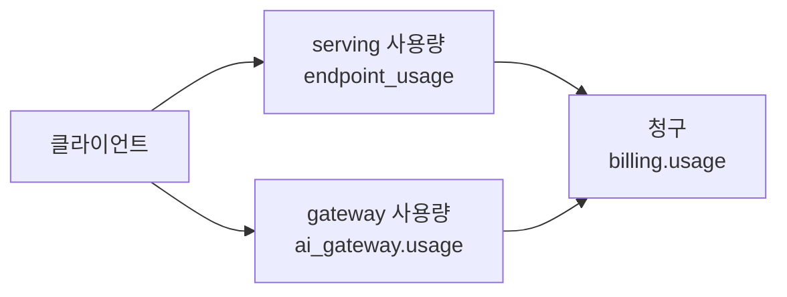

# 4. 사용량 모니터링

3장에서 라우트가 기록 위치를 결정한다고 했습니다. 이 장은 그 기록이 실제로 어느 테이블에 어떤 컬럼으로 쌓이는지를 다룹니다. 데이터는 즉시 반영되지 않을 수 있으니, 비어 있으면 잠시 후 새로고침해 다시 조회하세요.

## 4.1 4계층 모니터링 구조

사용량은 네 개의 계층으로 관찰합니다.



1. **클라이언트** — 호출 시점의 요청/응답 (실시간, 로컬)
2. **serving 사용량** — `system.serving.endpoint_usage`
3. **gateway 사용량** — `system.ai_gateway.usage`
4. **청구** — `system.billing.usage` (두 라우트 통합)

## 4.2 두 요청 단위 테이블은 배타적이다

> **핵심** — `system.serving.endpoint_usage`와 `system.ai_gateway.usage`는 **서로 배타적**입니다. 하나의 호출은 라우트에 따라 **둘 중 한 곳에만** 기록됩니다.
> - serving 라우트 → `endpoint_usage`에만
> - gateway 라우트 → `ai_gateway.usage`에만

그래서 gateway 대시보드가 계속 비어 있다면, 십중팔구 트래픽을 serving 라우트로만 보내고 있는 것입니다.

> **⚠️ Fallback 사용 시** — Fallback을 켠 엔드포인트에서는 **첫 성공 시도 또는 마지막 실패 시도만** 기록됩니다. 중간 실패 시도가 남지 않으므로, 호출 수를 세거나 비용을 귀속할 때 **클라이언트 기준 호출 수와 테이블 행 수가 일치하지 않을 수 있습니다**([3.4절](../03-calling-claude/README.md) 참조).

## 4.3 테이블별 주요 컬럼

| 테이블 | 주요 컬럼 | 용도 |
| --- | --- | --- |
| `system.serving.endpoint_usage` | `endpoint_name`, `served_entity_name`, `usage_context`, `input_tokens`, `output_tokens`, `request_time` | serving 라우트 요청 단위 사용량 + 귀속 |
| `system.ai_gateway.usage` | `endpoint_name`, `status_code`, `input_tokens`, `output_tokens`, `latency_ms`, `ttfb_ms` | gateway 라우트 요청 단위 사용량 + 지연 |
| `system.billing.usage` | `sku_name`, `usage_quantity`(DBU), `usage_metadata`, `custom_tags` | 청구/비용 (두 라우트 통합) |

## 4.4 조회 예제

`monitoring.sql`의 A/B/C 섹션을 그대로 사용합니다.

**A. serving 사용량 (최근 건):**

```sql
SELECT
  request_time,
  endpoint_name,
  served_entity_name,
  usage_context,
  input_tokens,
  output_tokens
FROM system.serving.endpoint_usage
WHERE request_time >= current_timestamp() - INTERVAL 24 HOURS
ORDER BY request_time DESC;
```

**B. gateway 사용량 (지연 포함):**

```sql
SELECT
  request_time,
  endpoint_name,
  status_code,
  input_tokens,
  output_tokens,
  latency_ms,
  ttfb_ms
FROM system.ai_gateway.usage
WHERE request_time >= current_timestamp() - INTERVAL 24 HOURS
ORDER BY request_time DESC;
```

**C. 모델별 지연 롤업 (gateway):**

```sql
SELECT
  endpoint_name,
  count(*) AS calls,
  round(avg(latency_ms)) AS avg_latency_ms
FROM system.ai_gateway.usage
WHERE status_code = 200
GROUP BY endpoint_name
ORDER BY avg_latency_ms;
```
